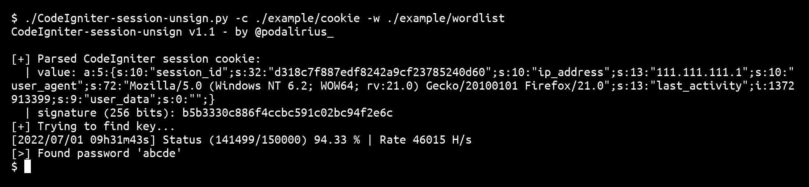

<p align="center">
  A multithreaded bruteforcer of CodeIgniter ci_session cookies.
  <br>
  
  <a href="https://twitter.com/intent/follow?screen_name=podalirius_" title="Follow"></a>
  <a href="https://www.youtube.com/c/Podalirius_?sub_confirmation=1" title="Subscribe"></a>
  <br>
</p>

## Features

 - [x] Extract the `ci_session` cookie from an URL (with `--url`) or from a file (with `--cookie`)
 - [x] Progress updated every second with the number of processed hashes per second.
 - [x] Multithreaded bruteforce.

## Usage

```
$ ./CodeIgniter-session-unsign.py -h
CodeIgniter-session-unsign v1.1 - by @podalirius_

usage: CodeIgniter-session-unsign.py [-h] [-u URL | -c COOKIE] -w WORDLIST [-t THREADS] [-k] [--md5 MD5 | --sha1 SHA1 | --sha256 SHA256]

Description message

optional arguments:
  -h, --help            show this help message and exit
  -u URL, --url URL     URL of the CodeIgniter website.
  -c COOKIE, --cookie COOKIE
                        CodeIgniter session cookie.
  -w WORDLIST, --wordlist WORDLIST
                        Wordlist of keys to test.
  -t THREADS, --threads THREADS
                        Number of threads (default: 8)
  -k, --insecure        Allow insecure server connections when using SSL (default: False)
  --md5 MD5             Use MD5 algorithm.
  --sha1 SHA1           Use SHA1 algorithm.
  --sha256 SHA256       Use SHA256 algorithm.
```

## Example

```
./CodeIgniter-session-unsign.py -c ./example/cookie -w ./example/wordlist
```



## Contributing

Pull requests are welcome. Feel free to open an issue if you want to add other features.

## References
 - https://www.websec.ca/publication/blog/insecure-session-data-CodeIgniter